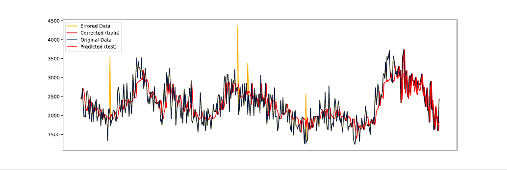

# Error Injection Framework
Framework for introducing errors in time series. According to two distrbutions that determine error magnitude and frequency.

Applied to assess robustness of two different forecasting methods LSTM and cLSTM

Code of framework inside file ['error.py'](error.py)

## Usage 

### For experiments
```
python lstm.py
python clstm.py
```

### For plots and statistics
```
plot.py
```

### Example

